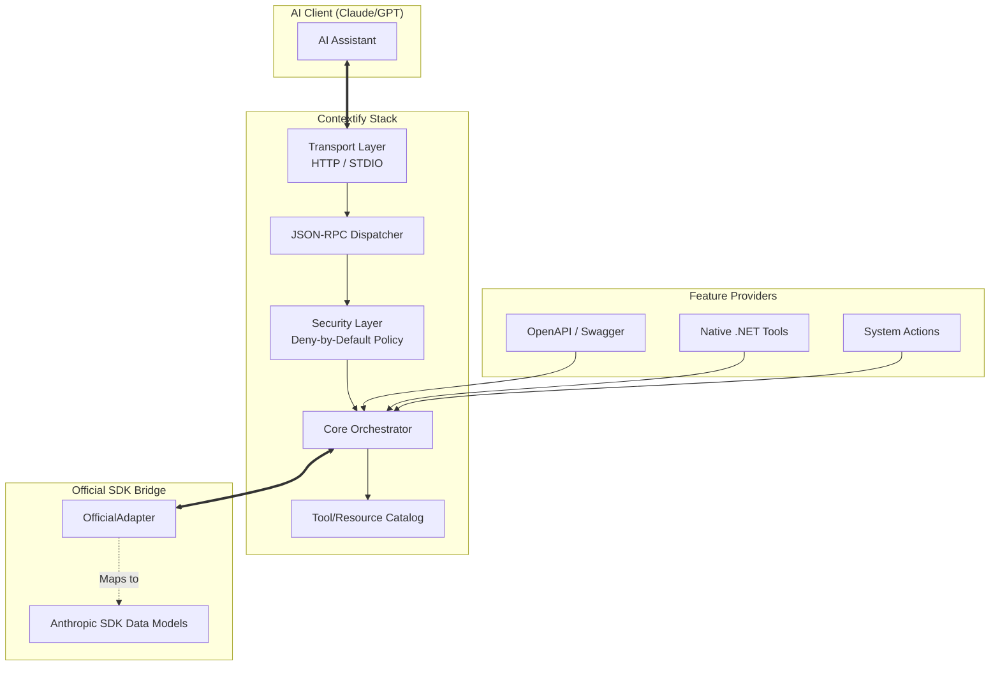

# Contextify

<p align="center">
  
</p>

<p align="center">
  <strong>A modular, enterprise-grade .NET framework for Model Context Protocol (MCP) servers</strong>
</p>

<p align="center">
  <a href="https://github.com/atakanatali/contextify-net/actions/workflows/ci.yml">
    
  </a>
  <a href="https://github.com/atakanatali/contextify-net/releases">
    
  </a>
  <a href="https://www.nuget.org/packages/Contextify.AspNetCore">
    
  </a>
  <a href="https://www.nuget.org/packages/Contextify.Core">
    
  </a>
  <a href="https://github.com/atakanatali/contextify-net/blob/main/LICENSE">
    
  </a>
</p>

---

## Core Architecture

Contextify provides a high-level orchestration layer that abstracts the complexities of the Model Context Protocol.



---

## Package Deep Dive

Contextify is a modular ecosystem. You only install what you need.

### 1. Foundation & Protocol Bridge
*   **[`Contextify.Abstractions`](https://www.nuget.org/packages/Contextify.Abstractions)**: Contains the essential contracts. If you want to build a custom tool provider or a new transport, you only need this.
*   **[`Contextify.Core`](https://www.nuget.org/packages/Contextify.Core)**: The heart of the framework. It manages the **Tool Catalog**, handles the execution lifecycle, and enforces **Security Policies**.
*   **[`Contextify.Mcp.OfficialAdapter`](https://www.nuget.org/packages/Contextify.Mcp.OfficialAdapter)**: This is a critical component that bridges Contextify's logic with the [official Anthropic `ModelContextProtocol` SDK](https://www.nuget.org/packages/ModelContextProtocol). It translates Contextify's internal tool/resource models into the exact JSON-RPC structures expected by the protocol.

### 2. Integration & Hosting
*   **[`Contextify.AspNetCore`](https://www.nuget.org/packages/Contextify.AspNetCore)**: Provides `AddContextify()` and `MapContextifyMcp()` extensions. It integrates with the standard .NET `ILogger`, `IOptions`, and Dependency Injection.
*   **[`Contextify.Transport.Http`](https://www.nuget.org/packages/Contextify.Transport.Http)**: Implements **Server-Sent Events (SSE)** for AI clients that communicate over HTTP (like most enterprise web apps).
*   **[`Contextify.Transport.Stdio`](https://www.nuget.org/packages/Contextify.Transport.Stdio)**: Implements the standard input/output transport, allowing your .NET application to act as a local MCP server for tools like the Claude Desktop app.

### 3. Capability Extensions
*   **[`Contextify.OpenApi`](https://www.nuget.org/packages/Contextify.OpenApi)**: A powerful engine that parses your existing Swagger/OpenAPI specifications and dynamically generates MCP tools. This allows you to expose existing microservices to AI in seconds.
*   **[`Contextify.Actions.Defaults`](https://www.nuget.org/packages/Contextify.Actions.Defaults)**: High-performance, native .NET implementations of common tasks (e.g., File I/O, System Info, Math).

### 4. Configuration & Security
*   **[`Contextify.Config.AppSettings`](https://www.nuget.org/packages/Contextify.Config.AppSettings)**: The standard way to configure tool whitelists via `appsettings.json`.
*   **[`Contextify.Config.Consul`](https://www.nuget.org/packages/Contextify.Config.Consul)**: Enables **Dynamic Context**. Change tool permissions in real-time across your entire fleet via Consul without restarting your services.

### 5. Multi-Backend Gateway
*   **[`Contextify.Gateway.Core`](https://www.nuget.org/packages/Contextify.Gateway.Core)**: Core logic for aggregating multiple upstream MCP servers into a single hub.
*   **[`Contextify.Gateway.Discovery.Consul`](https://www.nuget.org/packages/Contextify.Gateway.Discovery.Consul)**: Automated discovery of MCP servers in a microservices environment via Consul.

---

## How It Works: The Protocol Bridge

Contextify doesn't reimplement the protocol from scratch. Instead, it leverages the **Official Anthropic SDK**.

When an AI client (like Claude) sends a `tools/list` request:
1.  **Transport Layer** (HTTP or Stdio) receives the raw JSON and passes it to the **Dispatcher**.
2.  **Dispatcher** queries the **Core Orchestrator** for available tools.
3.  **Core Orchestrator** pulls from all registered providers (OpenAPI, System Actions, etc.) and filters them through the **Security Layer**.
4.  **OfficialAdapter** takes the whitelisted Contextify tool definitions and converts them into `ModelContextProtocol.Types.Tool` objects.
5.  The **Anthropic SDK** then handles the final JSON-RPC serialization and returns the compliant response to the client.

This "Best of Both Worlds" approach ensures 100% protocol compliance while offering a rich, .NET-idiomatic developer experience.

---

## Getting Started

### 1. Build a Web-based MCP Server (HTTP)
Expose your API to Claude through an HTTP endpoint.

**Installation:**
```bash
dotnet add package Contextify.AspNetCore
dotnet add package Contextify.Transport.Http
```

**Implementation:**
```csharp
var builder = WebApplication.CreateBuilder(args);

builder.Services.AddContextify()
    .AddHttpTransport(options => options.Endpoint = "/mcp")
    .AddAppSettingsPolicyProvider();

var app = builder.Build();
app.MapContextifyMcp();
app.Run();
```

### 2. Build a CLI MCP Server (STDIO)
Ideal for local development or custom CLI-based context providers.

**Installation:**
```bash
dotnet add package Contextify.Transport.Stdio
```

---

## Security: Deny-by-Default

Security is not an afterthought in Contextify. By default, **no tools are exposed**. You must explicitly whitelist tools in your configuration:

```json
{
  "Contextify": {
    "Security": {
      "DefaultPolicy": "Deny",
      "Whitelist": [
        { "ToolName": "weather:*", "Enabled": true },
        { "ToolName": "internal:user:read", "Enabled": true }
      ]
    }
  }
}
```

---

## The Gateway Pattern

When managing dozens of MCP servers, the **Contextify Gateway** allows you to aggregate them into a single, namespaced catalog.

- **Unified Catalog**: Merges upstream tools into one list.
- **Namespacing**: `upstream1:tool_name` prevents collisions.
- **Health Checks**: Automatically removes unhealthy upstreams.
- **Consul Discovery**: Add new MCP servers to your infrastructure without restarts.

---

## Documentation

- [Introduction to MCP](https://modelcontextprotocol.io/)
- [Architecture & Deep Dive](docs/architecture.md)
- [Example Projects](samples/)
- [Contributing](CONTRIBUTING.md)

---

## License
Licensed under the [MIT License](LICENSE).
