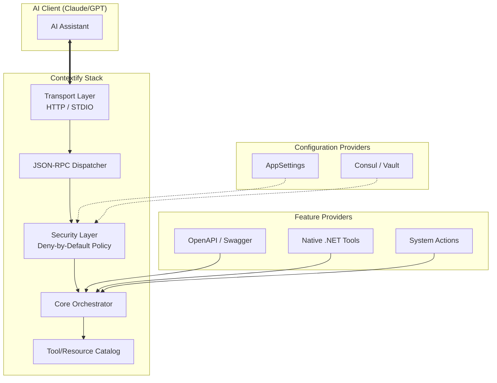

# Contextify

<p align="center">
  
</p>

## Modular, Enterprise-Grade .NET Framework for MCP

**Contextify** is a high-performance, modular framework built for the **Model Context Protocol (MCP)**. It provides a robust architecture for developing, orchestrating, and securing MCP servers, allowing you to seamlessly expose your application's tools, resources, and prompts to AI assistants like Claude and GPT.

Built on top of the official [Anthropic ModelContextProtocol SDK](https://www.nuget.org/packages/ModelContextProtocol), Contextify adds an enterprise layer including **Deny-by-Default security**, **Gateway aggregation**, and **Dynamic Configuration**.

---

## 🏗️ Core Architecture

Contextify is designed to be decoupled and extensible.



---

## 📦 Package Ecosystem

Contextify is distributed as a set of focused NuGet packages.

### Foundation
| Package | Description |
|---------|-------------|
| [`Contextify.Abstractions`](#) | Common interfaces, DTOs, and the core contract for tools and resources. |
| [`Contextify.Core`](#) | The engine of the framework. Handles tool discovery, orchestration, and execution logic. |
| [`Contextify.Mcp.OfficialAdapter`](#) | **The Bridge.** Adapts Contextify's feature-rich model to the official Anthropic MCP SDK. |

### Transports & Integration
| Package | Description |
|---------|-------------|
| [`Contextify.AspNetCore`](#) | Seamless integration with ASP.NET Core Dependency Injection and Middleware. |
| [`Contextify.Transport.Http`](#) | Enterprise-ready HTTP/SSE transport for web-based MCP servers. |
| [`Contextify.Transport.Stdio`](#) | Standard I/O transport for CLI tools and local IDE integrations. |

### Extensions & Tooling
| Package | Description |
|---------|-------------|
| [`Contextify.OpenApi`](#) | Automatically transforms OpenAPI/Swagger documents into MCP-compatible tools. |
| [`Contextify.Actions.Defaults`](#) | A collection of ready-to-use system tools (Time, Math, Echo, etc.). |

### Configuration & Security
| Package | Description |
|---------|-------------|
| [`Contextify.Config.AppSettings`](#) | Static policy management via standard `appsettings.json`. |
| [`Contextify.Config.Consul`](#) | Dynamic, remote policy provider using HashiCorp Consul. |

### Distributed Gateway
| Package | Description |
|---------|-------------|
| [`Contextify.Gateway.Core`](#) | Logic for aggregating multiple MCP backends into a single entry point. |
| [`Contextify.Gateway.Discovery.Consul`](#) | Auto-discovery for MCP upstreams using Consul. |

---

## 🚀 Getting Started

### 1. Build a Web-based MCP Server (HTTP)
Expose your API to Claude through an HTTP endpoint.

**Installation:**
```bash
dotnet add package Contextify.AspNetCore
dotnet add package Contextify.Transport.Http
```

**Implementation:**
```csharp
var builder = WebApplication.CreateBuilder(args);

builder.Services.AddContextify()
    .AddHttpTransport(options => options.Endpoint = "/mcp")
    .AddAppSettingsPolicyProvider();

var app = builder.Build();
app.MapContextifyMcp();
app.Run();
```

### 2. Build a CLI MCP Server (STDIO)
Ideal for local development or custom CLI-based context providers.

**Installation:**
```bash
dotnet add package Contextify.Transport.Stdio
```

---

## 🛡️ Security: Deny-by-Default

Security is not an afterthought in Contextify. By default, **no tools are exposed**. You must explicitly whitelist tools in your configuration:

```json
{
  "Contextify": {
    "Security": {
      "DefaultPolicy": "Deny",
      "Whitelist": [
        { "ToolName": "weather:*", "Enabled": true },
        { "ToolName": "internal:user:read", "Enabled": true }
      ]
    }
  }
}
```

---

## 🌐 The Gateway Pattern

When managing dozens of MCP servers, the **Contextify Gateway** allows you to aggregate them into a single, namespaced catalog.

- **Unified Catalog**: Merges upstream tools into one list.
- **Namespacing**: `upstream1:tool_name` prevents collisions.
- **Health Checks**: Automatically removes unhealthy upstreams.
- **Consul Discovery**: Add new MCP servers to your infrastructure without restarts.

---

## 📗 Documentation

- [Introduction to MCP](https://modelcontextprotocol.io/)
- [Architecture & Deep Dive](docs/architecture.md)
- [Example Projects](samples/)
- [Contributing](CONTRIBUTING.md)

---

## License
Licensed under the [MIT License](LICENSE).
