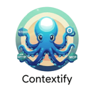
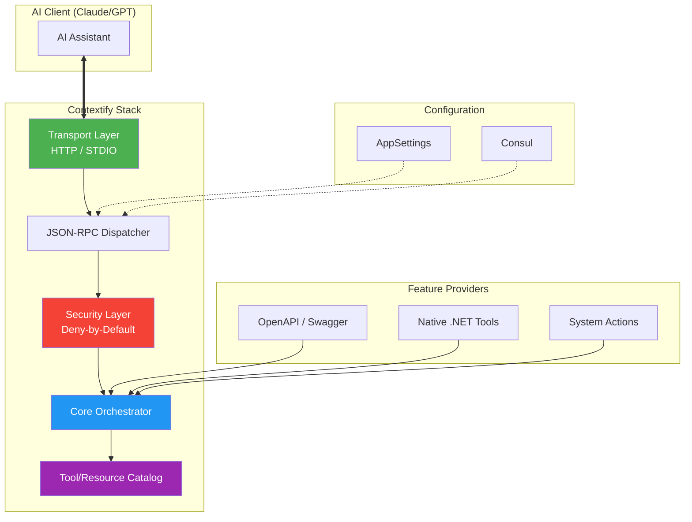

# Contextify

<p align="center">
  
</p>

<p align="center">
  <strong>A modular, enterprise-grade .NET framework for Model Context Protocol (MCP) servers</strong>
</p>

<p align="center">
  <a href="https://github.com/atakanatali/contextify-net/actions/workflows/ci.yml">
    
  </a>
  <a href="https://github.com/atakanatali/contextify-net/releases">
    
  </a>
  <a href="https://www.nuget.org/packages/Contextify.AspNetCore">
    
  </a>
  <a href="https://www.nuget.org/packages/Contextify.Core">
    
  </a>
  <a href="https://github.com/atakanatali/contextify-net/blob/main/LICENSE">
    
  </a>
</p>

---

## Core Architecture



### Package Structure

| Package | Description | NuGet |
|---------|-------------|-------|
| `Contextify.Abstractions` | Common interfaces and models | [](https://www.nuget.org/packages/Contextify.Abstractions) |
| `Contextify.Core` | Core framework and tool orchestration | [](https://www.nuget.org/packages/Contextify.Core) |
| `Contextify.AspNetCore` | DI + ASP.NET Core integration | [](https://www.nuget.org/packages/Contextify.AspNetCore) |
| `Contextify.Transport.Http` | HTTP transport for MCP | [](https://www.nuget.org/packages/Contextify.Transport.Http) |
| `Contextify.Transport.Stdio` | STDIO transport for MCP | [](https://www.nuget.org/packages/Contextify.Transport.Stdio) |
| `Contextify.OpenApi` | OpenAPI to MCP conversion | [](https://www.nuget.org/packages/Contextify.OpenApi) |

---

Contextify is a high-performance, modular library for building Model Context Protocol (MCP) servers in .NET. It allows you to expose your application's logic, data, and tools to AI assistants with enterprise-grade security and observability.

## Quickstart

### 1. Register Services
```csharp
// Add Contextify with Gateway and HTTP support
builder.Services.AddContextify()
    .AddHttpTransport(http => 
    {
        http.Endpoint = "/mcp/v1";
    })
    .AddAppSettingsPolicyProvider();
```

### 2. Map Endpoints
```csharp
app.MapContextifyMcp();
```

## Key Features

### 🛡️ Security First
- **Deny-by-Default**: No tool is exposed unless explicitly whitelisted in policy.
- **Request Validation**: Strict JSON-RPC schema and size limit enforcement.
- **Namespace Isolation**: Prevent tool naming collisions in multi-backend setups.

### 🔌 Modular Transports
- **HTTP**: Enterprise-ready transport with middleware support.
- **STDIO**: Native integration for CLI and local development workflows.

### 🔀 Gateway Aggregation
The **Contextify Gateway** acts as a unified hub for multiple MCP servers, providing:
- Concatenated tool catalogs with prefix namespacing.
- Resilient upstream health monitoring.
- Centralized policy enforcement across distributed services.

## Documentation

- [Architecture Guide](docs/architecture.md)
- [Configuration Reference](docs/architecture.md#configuration)
- [Gateway Setup](docs/architecture.md#gateway)
- [Official MCP Specification](https://modelcontextprotocol.io/)

## License

MIT License - see [LICENSE](LICENSE) for details.
